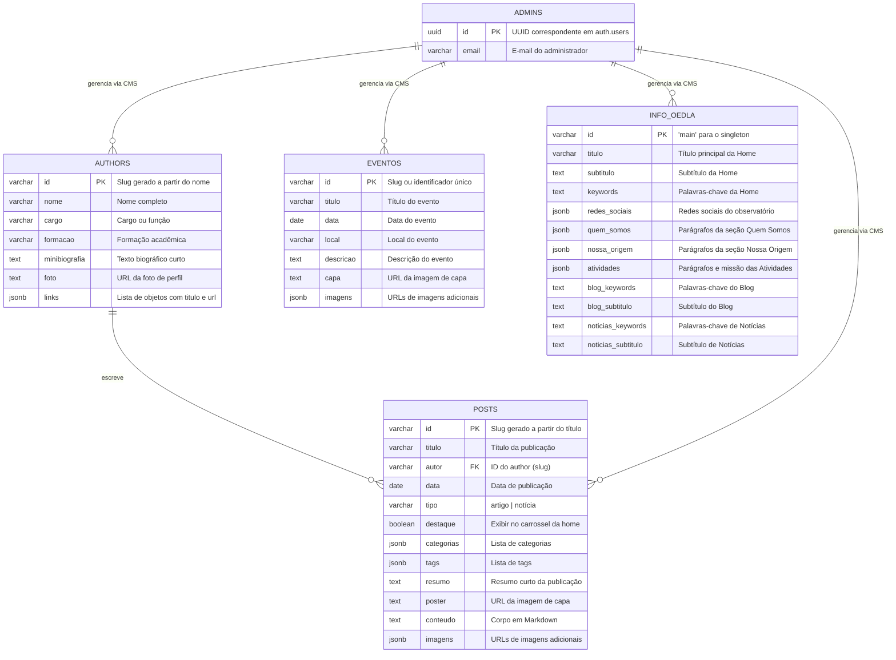

# OEDLA – Observatório da Extrema Direita Latino-Americana

Este repositório contém o código-fonte do site do OEDLA, um observatório de pesquisa dedicado ao estudo da extrema direita na América Latina. O site é construído usando HTML, CSS e JavaScript, com Supabase (PostgreSQL + Auth + Storage) como backend, e é hospedado no GitHub Pages.

## Documentação para colaboradores

- [Como adicionar integrantes](docs/COMO_ADICIONAR_INTEGRANTES.md)
- [Como publicar posts no blog](docs/COMO_PUBLICAR_POSTS.md)

## Banco de Dados (Supabase PostgreSQL)

A aplicação utiliza o **Supabase** como banco de dados relacional. Abaixo está o diagrama das tabelas e seus campos.

### Diagrama ER

### Descrição das Tabelas

| Tabela       | Chave Primária       | Descrição                                                                 |
|--------------|----------------------|---------------------------------------------------------------------------|
| `posts`      | Slug do título       | Publicações do tipo artigo (blog) ou notícia                              |
| `authors`    | Slug do nome         | Integrantes/autores do observatório                                       |
| `eventos`    | Slug do título       | Eventos organizados pelo observatório                                     |
| `info_oedla` | 'main'               | Configurações e textos dinâmicos das páginas institucionais               |
| `admins`     | ID (auth.users)      | Usuários com permissão de acesso ao painel CMS (`pages/admin.html`)       |

### Relacionamentos

- **`posts.autor`** → referencia o **`id`** de uma linha na tabela `authors`.
- **`admins`** → a linha possui o mesmo **UUID** do usuário no Supabase Auth; sua existência concede acesso ao CMS.
- **`posts.destaque`** → quando `true`, o post aparece no carrossel "Em Destaque" da página principal.

