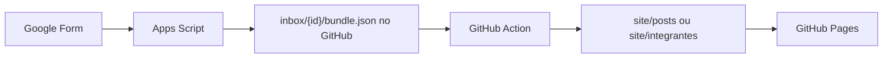

# Google Forms como injetor de conteúdo

O fluxo publica automaticamente no GitHub Pages quando alguém envia um Google Form.



## 1. Token do GitHub

1. Acesse [GitHub → Settings → Developer settings → Personal access tokens](https://github.com/settings/tokens).
2. Crie um token (classic) com escopo `repo`, **ou** um fine-grained token com:
   - **Contents**: Read and write
   - **Actions**: Read and write (para `repository_dispatch`)
3. Guarde o token em local seguro.

## 2. Google Apps Script

1. Abra o Google Form de publicações.
2. Menu **Extensões → Apps Script**.
3. Cole o conteúdo de `scripts/google-apps-script/Code.gs`.
4. Em **Projeto → Configurações do projeto → Propriedades do script**, adicione:

| Propriedade     | Valor                  |
|-----------------|------------------------|
| `GITHUB_TOKEN`  | seu PAT                |
| `GITHUB_REPO`   | `oedla-unicamp/oedla-unicamp.github.io`  |

5. Crie um gatilho:
   - Função: `onPostFormSubmit`
   - Evento: **Ao enviar o formulário**

Repita para o Form de integrantes com `onIntegranteFormSubmit`.

### Campos do Form — Publicação

| Campo            | Tipo              | Exemplo                          |
|------------------|-------------------|----------------------------------|
| Tipo             | Múltipla escolha  | `Blog` ou `Notícia`              |
| Título           | Texto curto       | `Análise sobre...`               |
| Slug             | Texto curto       | `analise-sobre` (opcional)       |
| Categorias       | Texto curto       | `política, método`               |
| Autores          | Texto curto       | `geraldo, andre`                 |
| Data             | Data              | `2026-06-21`                     |
| Resumo           | Parágrafo         | Uma frase                        |
| Corpo            | Parágrafo         | Markdown com `{1}`, `{2}`...     |
| Capa             | Upload de arquivo | imagem de capa                   |
| Imagens corpo do texto | Upload de arquivo | vários arquivos: 1º=`{1}`, 2º=`{2}` |
| Imagem 1         | Upload (opcional) | alternativa: um campo por imagem |
| Imagem 2         | Upload (opcional) | ...                              |

Use **uma** das opções para imagens do corpo:
- um campo **Imagens corpo do texto** com vários uploads, **ou**
- campos separados **Imagem 1**, **Imagem 2**, etc.

Títulos que contenham **"imagens"** e **"corpo"** também funcionam (ex.: `Imagens corpo do texto`).

### Campos do Form — Integrante

| Campo          | Tipo              | Exemplo                                      |
|----------------|-------------------|----------------------------------------------|
| Nome           | Texto curto       | `Maria Silva`                                |
| Slug           | Texto curto       | `maria-silva` (opcional)                     |
| Cargo          | Texto curto       | `Pesquisadora`                               |
| Formação       | Texto curto       | `Doutoranda em...`                           |
| Minibiografia  | Parágrafo         | Texto curto                                  |
| Foto           | Upload de arquivo | Foto de perfil                               |
| Links          | Parágrafo         | Um por linha: `Título\|URL`                  |

Formato de links (um por linha):

```
Lattes|http://lattes.cnpq.br/123
ORCID|https://orcid.org/0000-0000
Instagram|https://instagram.com/perfil
LinkedIn|https://linkedin.com/in/perfil
```

O site detecta o ícone automaticamente pelo título ou pela URL. Lattes aparece em texto, sem ícone.

## 3. GitHub Action

O workflow `.github/workflows/publish-from-forms.yml` já está no repositório. Ele:

1. Lê `inbox/{submissionId}/bundle.json` (enviado pelo Apps Script)
2. Gera os arquivos em `site/posts/...` ou `site/integrantes/...`
3. Atualiza `posts.json` ou `integrantes.json`
4. Remove a pasta `inbox/`
5. Faz commit e push → GitHub Pages atualiza

## 4. Testar localmente (sem Form)

```bash
mkdir -p inbox/teste-post
# Crie um bundle.json de teste (sem base64 real para teste rápido de estrutura)
SUBMISSION_ID=teste-post node scripts/forms-injector/inject.mjs
```

## 5. Estrutura gerada

**Post (blog):**

```
site/posts/artigos/meu-slug/
├── post.md
└── img/
    ├── capa.jpg
    ├── 1.jpg
    └── 2.png
```

**Integrante:**

```
site/integrantes/maria-silva.json
site/integrantes/img/maria-silva.jpg
```

## Observações

- Os títulos dos campos no Google Form devem ser **exatamente** os listados acima (o Apps Script mapeia por título).
- Imagens grandes aumentam o `bundle.json`; para posts com muitas fotos, prefira comprimir antes do envio.
- O repositório precisa ter a Action habilitada em **Settings → Actions → General**.
